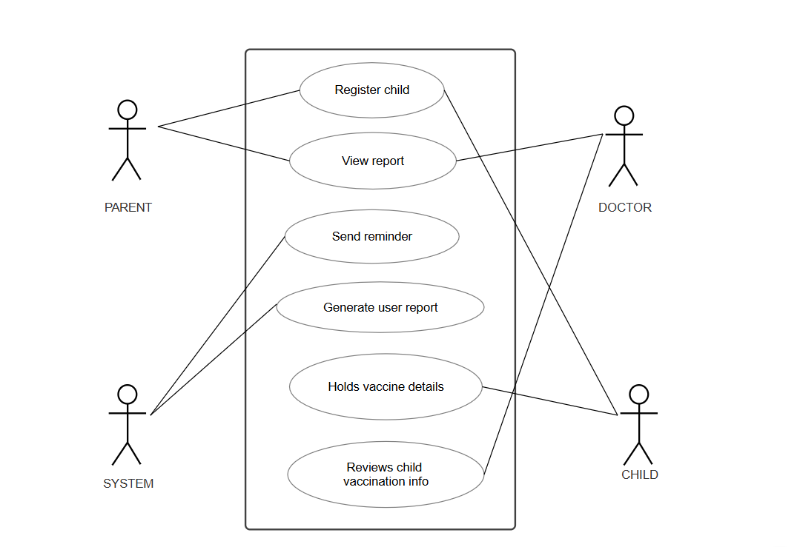
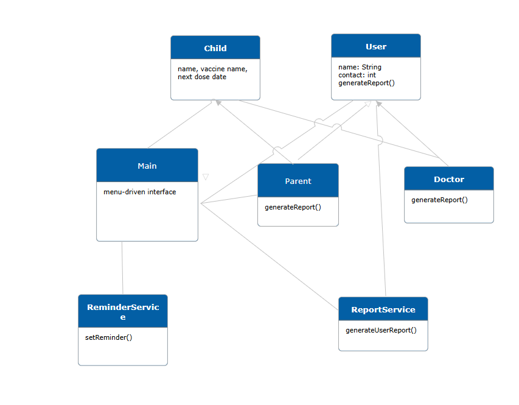
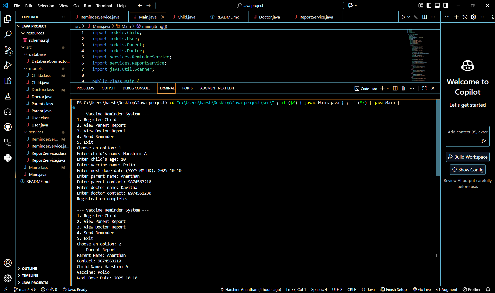

💉 **Vaccine Reminder System**

A console-based Java application that helps parents and doctors manage child vaccination schedules. Built with strong OOP principles including encapsulation, inheritance, polymorphism, and abstraction.

📌 **Problem Statement**

Many parents find it difficult to keep track of vaccination timelines, which may cause some doses to be missed or delayed. To solve this, we aim to build a system that records child details, maintains their vaccination history, and automatically calculates the due dates for upcoming vaccines (e.g., Polio booster at 2.5 years).

🔑 **Features**

✔️ Child registration and parent information storage

✔️ Predefined vaccine schedule with age-based reminders

✔️ Record of previous vaccinations

✔️ Notifications of upcoming vaccines

✔️ Summary reports of pending and completed doses

**Future Enhancements**

Automated reminders via email/SMS/app.

User-friendly dashboard using JavaFX.

Role-based access for doctors, parents, and administrators.

🛠️ **Technology Stack**

Programming Language: Java

Architecture: Object-Oriented Programming (OOP)

IDE: VS Code

Design Principles: Encapsulation, Inheritance, Polymorphism, Abstraction

Database: MySQL

Database Connectivity: JDBC

Version Control: Git & GitHub

📂 **Proposed Project Structure**

Vaccine-Reminder-System/

│── src/

│   ├── models/        # Core classes (Child, Vaccine, Record)

│   ├── database/      # JDBC connection and queries

│   ├── services/      # Business logic (schedule, reminders)

│   └── Main.java      # Program entry point

│

│── resources/

│   └── schema.sql     # Database design and setup

│

│── README.md

**UML Diagrams**

### Use Case Diagram

### Class Diagram

## Prototype Output

🚀 **Future Scope**

Integration with hospital or clinic management systems.

Issuing digital vaccination certificates.

Mobile application support for parents to track and receive alerts.
